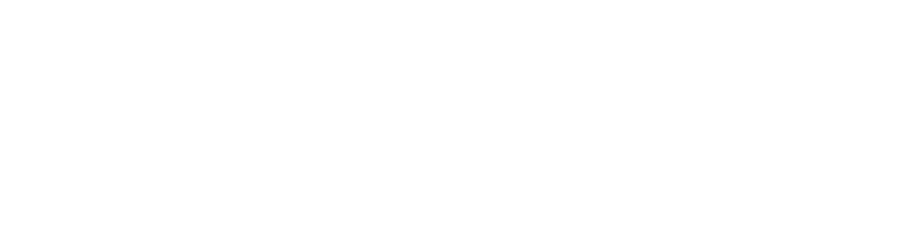

# PolyQuery

A minimalist, integer-only Relational Database Management System with advanced query and graph capabilities.
  

## _Data Systems, Monsoon 2025_

---

### Important Features

- Relational Algebra Operators (Select, Project, Rename, Cross, Join)
- Integers Only Data
- Aggregate operations & Grouping (`SUM`, `AVG`, `MIN`, `MAX`, `GROUP BY`)
- External Sorting & Indexing Optimization
- Graph Processing (Directed/Undirected, Path algorithms, Degree)
- Transaction Management with Concurrency Control (Wait-Die protocol)
- Multi-threaded Execution

---

### Commands

There are 2 kinds of commands in this database:

- Assignment statements (create a new relation/table)
- Non-assignment statements (do not create a new relation)

---

## Non Assignment Statements

Non-assignment statements do not create a new table (except `LOAD` which loads an existing entity into memory).

- LOAD / LOAD GRAPH
- LIST TABLES / LIST GRAPHS
- PRINT / PRINT GRAPH
- RENAME
- EXPORT / EXPORT GRAPH
- CLEAR
- INDEX
- QUIT

---

### LOAD & SOURCE

Syntax:
```
LOAD <table_name>
LOAD GRAPH <graph_name> <U/D>
LOAD VECTOR MATRIX <matrix_name> <dimension>
SOURCE <query_name>
```
- `LOAD`: Loads a table from `data/<table_name>.csv`
- `LOAD GRAPH`: Loads graph nodes and edges from CSVs (U for Undirected, D for Directed).
- `LOAD VECTOR MATRIX`: Loads a dense matrix/vector embeddings dataset from `data/<matrix_name>.csv`.
- `SOURCE`: Executes a script of queries from `data/<query_name>.ra`

---

### PRINT & LIST

Syntax:
```
PRINT <table_name>
PRINT GRAPH <graph_name>
LIST TABLES
LIST GRAPHS
LIST MATRICES
DESCRIBE <relation_name>
CHECKSUM <table_name>
```
- `PRINT`: Displays the first few rows (up to `PRINT_COUNT`).
- `LIST TABLES`: Shows all tables loaded or created in the current session.
- `LIST GRAPHS` / `LIST MATRICES` (vidvathamaiiith extensions): enumerate the graph and vector-matrix catalogues respectively.
- `DESCRIBE` (vidvathamaiiith extension): reports schema and storage statistics for a table, matrix, or graph without materialising any rows.
- `CHECKSUM` (vidvathamaiiith extension): streams a table and reports a deterministic 64-bit content fingerprint for integrity/equality checks.

---

### RENAME

Syntax:
```
RENAME <toColumnName> TO <fromColumnName> FROM <table_name>
```

- Renames a specific column in an existing table.

---

### EXPORT & CLEAR

Syntax:
```
EXPORT <table_name>
EXPORT GRAPH <graph_name>
CLEAR <table_name>
```
- `EXPORT`: Writes the in-memory changes back to disk as a CSV file.
- `CLEAR`: Removes a table from the system's memory.

---

### INDEX

Syntax:
```
INDEX ON <columnName> FROM <table_name> USING <indexing_strategy>
```

Where `<indexing_strategy>` could be:
- `BTREE` - BTree indexing on column
- `HASH` - Index via a hashmap
- `NOTHING` - Removes index if present 

---

## Assignment Statements

- All assignment statements lead to the creation of a new table. 
- Every statement is of the form `<new_table_name> <- <assignment_statement>`
- The newly created table can be operated on or exported.

---

### SELECTION & PROJECTION

Syntax
```
<new_table> <- SELECT <condition> FROM <table_name>
<new_table> <- PROJECT <col1>(,<colN>)* FROM <table_name>
```
- **SELECT**: Filters rows based on `<condition>` (e.g. `A > 5`, `A == B`).
- **PROJECT**: Keeps only the specified columns.

---

### JOIN & CROSS

Syntax
```
<new_table> <- JOIN <table1>, <table2> ON <column1> <bin_op> <column2>
<new_table> <- CROSS <table1> <table2>
```
- **JOIN**: Performs a relational join on two tables.
- **CROSS**: Performs a cartesian product of two tables.

---

### GROUP BY & AGGREGATE

Syntax
```
<new_table> <- GROUP BY <col> FROM <table> RETURN MAX(<col1>), MIN(<col2>)
```
- Groups rows by the specified column and returns aggregate computations. Supports `MAX`, `MIN`, `SUM`, `AVG`.

---

### SORT

Syntax
```
<new_table> <- SORT <table_name> BY <column_name> IN <sorting_order>
```
- Sorts a table using external sorting techniques for handling large datasets that exceed memory limits.
- `<sorting_order>` can be `ASC` or `DESC`.

---

### PATH (Graph Algorithms)

Syntax
```
<new_table> <- PATH <graph_name> <src_NodeID> <dest_NodeID> [WHERE <conditions>]
```
- Computes whether a path exists between two nodes in a given graph.
- Supports filtering paths based on specific edge/node constraints.

---

### KNN (Vector Database)

Syntax
```
<new_table> <- KNN <matrix_name> QUERY_VEC [f1, f2...] TOP <X> METRIC <COSINE|EUCLIDEAN|MANHATTAN>
```
- Performs a K-Nearest Neighbors search over the specified vector matrix.
- `QUERY_VEC` is the target vector you want to find neighbors for.
- `TOP <X>` specifies the number of closest rows to retrieve.
- `MANHATTAN` (L1 / taxicab distance) is a vidvathamaiiith extension alongside the original `COSINE` and `EUCLIDEAN` metrics.
- Outputs an ordered table with `RecordID` and `Similarity_Score` (smaller is closer).

---

### Transaction Management

- Supports multi-threaded execution of queries using `TRANSACTION`.
- Implements a strict **Wait-Die** deadlock prevention scheme.
- Manages shared and exclusive locks dynamically for safe concurrent data access.

---

### Internals

- **Buffer Manager**: Manages memory limits, evicts pages (FIFO).
- **Table / Graph Catalogue**: Indexes entities currently loaded.
- **Cursors**: Read from tables seamlessly block-by-block.
- **Executors**: Implement the core logic for each operator.

---

### Command Execution Flow



Query goes through Syntactic Parser -> Semantic Parser -> Executor.

---

## Architecture Evolution

- **Phase 1**: Basic Relational Algebra Operators
- **Phase 2**: Graph Handling & Advanced Queries (External Sort, Group By)
- **Phase 3**: Transaction Management & Concurrency Control
- **Phase 4**: Vector DB Extensions (`LOAD VECTOR MATRIX`, `KNN` computations via custom matrix buffer management)

---

## References

- Base framework derived from PolyQuery
- Extended with advanced functionality by Team 20.
